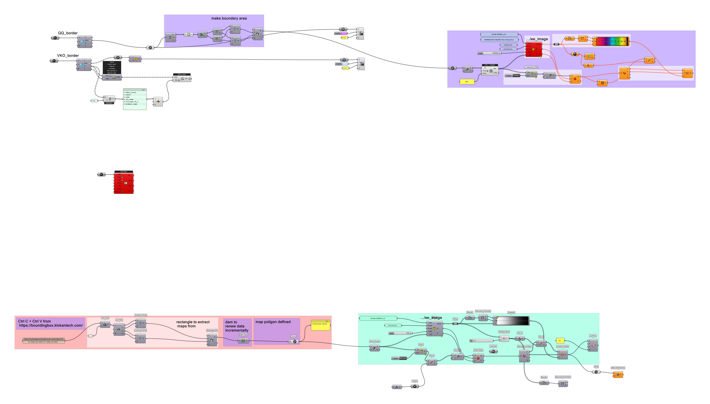
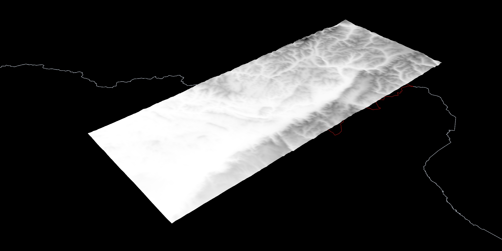

# 3D landscape_with_Grasshopper 
## Building 3d landscape with Grasshopper 3D 
tools: Grasshopper (Rhinoceros 3d 7), Hops, Decoding Spaces, Urbano, EarthEngine.

## Questions
- How to make a comprehensive 3d map of any location of the World?

## What I learned: 
- Building 3d maps with Grasshopper from satellite images.

## Key takeaways
- accuracy of map is limited by 90*90-m pixel

## piece of code
1. making 3d landscape in Grasshopper.  
2. [source>>](QQ_00.gh)

## data visualization
### 3d landscape of a disctrict in Kazakhstan.

##  References
- SRTM Digital Elevation Data Version 4  - [Google Earth Engine](https://developers.google.com/earth-engine/datasets/catalog/CGIAR_SRTM90_V4)
- [Bounding Box Map](https://boundingbox.klokantech.com/)
- GeoMining Technology - Iacopo Neri. [GitHub](https://github.com/neriiacopo/GeoMining-EE-Hops)
